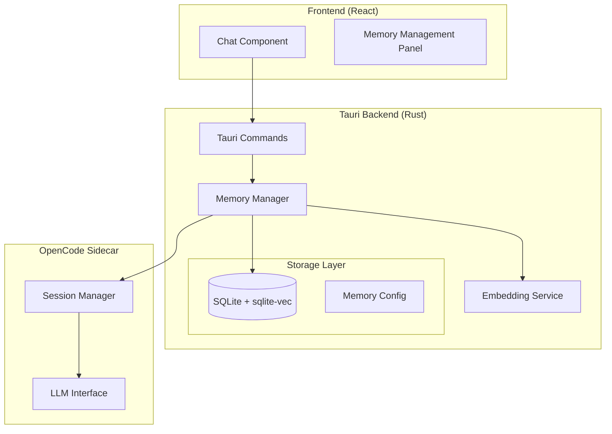
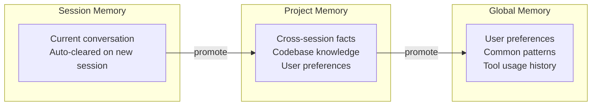

# Memory Context Implementation Plan for Tandem

## Executive Summary

This document outlines a comprehensive plan for adding local vector-based memory context to Tandem. The solution provides session-level, cross-session, and project-level memory while maintaining the application's privacy-first, local-only architecture.

## Current Architecture Analysis

### Existing Components

- **Frontend**: React + Vite + TypeScript ([`src/components/chat/Chat.tsx`](src/components/chat/Chat.tsx:1))
- **Backend**: Tauri v2 with Rust ([`src-tauri/src/lib.rs`](src-tauri/src/lib.rs:1))
- **Sidecar**: OpenCode binary for AI operations ([`src-tauri/src/sidecar.rs`](src-tauri/src/sidecar.rs:1))
- **State Management**: In-memory Rust state with Tauri store plugin ([`src-tauri/src/state.rs`](src-tauri/src/state.rs:1))
- **Session Management**: OpenCode-managed sessions via HTTP API ([`src-tauri/src/sidecar.rs`](src-tauri/src/sidecar.rs:1016))

### Message Flow

```
User Input → Chat.tsx → Tauri Command → SidecarManager → OpenCode Sidecar → LLM
                                              ↓
                                         SSE Events ← Response Streaming
```

## Recommended Solution: SQLite + Local Embeddings

### Why SQLite + `sqlite-vec`?

1. **Zero Additional Dependencies**: SQLite is already widely used; `sqlite-vec` is a lightweight extension
2. **Single File Storage**: Easy backup, migration, and cleanup
3. **Cross-Platform**: Works identically on Windows, macOS, Linux
4. **Size Efficient**: ~50MB per 100K embeddings (384-dim)
5. **No External Services**: Fully local, privacy-preserving
6. **Mature Ecosystem**: `rusqlite` crate is well-maintained

### Comparison with Alternatives

| Solution                | Pros                                 | Cons                                 | Recommendation             |
| ----------------------- | ------------------------------------ | ------------------------------------ | -------------------------- |
| **SQLite + sqlite-vec** | Single file, proven, small footprint | Manual embedding generation          | **PRIMARY CHOICE**         |
| **LanceDB**             | Native vector ops, fast              | Additional dependency, larger binary | Good alternative           |
| **Qdrant (embedded)**   | Full-featured vector DB              | Heavy, ~100MB+ overhead              | Overkill for this use case |
| **Chroma (embedded)**   | Simple API                           | Python-based, heavy deps             | Not suitable               |
| **HNSW in memory**      | Fast, no disk                        | Lost on restart, memory bloat        | Not suitable               |

## Architecture Design

### System Overview



### Memory Tiers



## Database Architecture: Single File vs. Separate Files

### Recommendation: Single Database File with Separate Tables

For Tandem's use case, I recommend using **a single SQLite database file** with separate tables for different memory tiers. Here's why:

**Single File Advantages:**

1. **Atomic operations** - Can delete session memory while keeping project memory in one transaction
2. **Simpler backup** - One file to backup/restore
3. **Referential integrity** - Foreign keys work across tables
4. **Easier management** - One connection pool, one WAL file

**When to Consider Separate Files:**

- If you expect users to want to "archive" or "export" vector data independently
- If different projects need completely isolated memory (though table prefixes solve this)
- If you need to move vector data to external storage

**Implementation with Single File:**

```rust
// Database structure in single file: tandem_memory.db
//
// Tables:
// - session_memory_chunks      (auto-cleared per session)
// - session_memory_vectors     (virtual table for vectors)
// - project_memory_chunks      (persistent project facts)
// - project_memory_vectors     (virtual table for vectors)
// - global_memory_chunks       (cross-project user preferences)
// - global_memory_vectors      (virtual table for vectors)
// - memory_config              (settings per project)
// - memory_stats               (usage tracking)
```

**Selective Cleanup from Single File:**

```rust
impl MemoryManager {
    /// Clear only session memory while preserving project/global
    pub async fn clear_session_memory(&self, session_id: &str) -> Result<u64, MemoryError> {
        let conn = self.db.lock().await;

        let deleted = conn.execute(
            "DELETE FROM session_memory_chunks WHERE session_id = ?1",
            params![session_id],
        )?;

        // Virtual table automatically cleans up via foreign key or trigger
        conn.execute(
            "DELETE FROM session_memory_vectors WHERE chunk_id NOT IN
             (SELECT id FROM session_memory_chunks)",
            [],
        )?;

        // Vacuum to reclaim space immediately
        conn.execute("VACUUM", [])?;

        Ok(deleted as u64)
    }

    /// Clear all vector data but keep config
    pub async fn clear_all_memory_data(&self) -> Result<(), MemoryError> {
        let conn = self.db.lock().await;

        conn.execute("DELETE FROM session_memory_chunks", [])?;
        conn.execute("DELETE FROM session_memory_vectors", [])?;
        conn.execute("DELETE FROM project_memory_chunks", [])?;
        conn.execute("DELETE FROM project_memory_vectors", [])?;
        conn.execute("DELETE FROM global_memory_chunks", [])?;
        conn.execute("DELETE FROM global_memory_vectors", [])?;

        conn.execute("VACUUM", [])?;

        Ok(())
    }

    /// Get storage breakdown by memory type
    pub async fn get_storage_stats(&self) -> Result<StorageStats, MemoryError> {
        let conn = self.db.lock().await;

        let session_size: i64 = conn.query_row(
            "SELECT COALESCE(SUM(LENGTH(content)), 0) FROM session_memory_chunks",
            [],
            |row| row.get(0),
        )?;

        let project_size: i64 = conn.query_row(
            "SELECT COALESCE(SUM(LENGTH(content)), 0) FROM project_memory_chunks",
            [],
            |row| row.get(0),
        )?;

        let global_size: i64 = conn.query_row(
            "SELECT COALESCE(SUM(LENGTH(content)), 0) FROM global_memory_chunks",
            [],
            |row| row.get(0),
        )?;

        // Get actual file size
        let file_size = std::fs::metadata(&self.db_path)?.len();

        Ok(StorageStats {
            session_bytes: session_size as u64,
            project_bytes: project_size as u64,
            global_bytes: global_size as u64,
            total_file_bytes: file_size,
        })
    }
}
```

**Alternative: Table-per-Project Pattern**

If you want to completely isolate projects (allowing users to delete one project's memory without affecting others):

```rust
// Dynamic table names per project
fn get_project_table_name(project_id: &str) -> String {
    format!("project_{}_chunks", sanitize_project_id(project_id))
}

// This allows: DROP TABLE project_abc123_chunks
```

But this complicates the schema management. The **single file with filtered DELETE operations** is cleaner for most use cases.

### Updated Schema for Single File with Cleanup Support

```sql
-- Session memory (ephemeral, auto-cleared)
CREATE TABLE session_memory_chunks (
    id TEXT PRIMARY KEY,
    session_id TEXT NOT NULL,
    content TEXT NOT NULL,
    content_type TEXT NOT NULL,
    role TEXT,
    metadata JSON,
    created_at TIMESTAMP DEFAULT CURRENT_TIMESTAMP,
    access_count INTEGER DEFAULT 0,
    last_accessed TIMESTAMP,
    is_pinned BOOLEAN DEFAULT 0
);

CREATE INDEX idx_session_chunks_session ON session_memory_chunks(session_id);
CREATE INDEX idx_session_chunks_accessed ON session_memory_chunks(last_accessed);

-- Session vectors (virtual table)
CREATE VIRTUAL TABLE session_memory_vectors USING vec0(
    chunk_id TEXT PRIMARY KEY,
    embedding FLOAT[384]
);

-- Project memory (persistent)
CREATE TABLE project_memory_chunks (
    id TEXT PRIMARY KEY,
    project_id TEXT NOT NULL,
    content TEXT NOT NULL,
    content_type TEXT NOT NULL,
    source_session_id TEXT,  -- Track where this came from
    metadata JSON,
    created_at TIMESTAMP DEFAULT CURRENT_TIMESTAMP,
    access_count INTEGER DEFAULT 0,
    last_accessed TIMESTAMP,
    is_pinned BOOLEAN DEFAULT 0
);

CREATE INDEX idx_project_chunks_project ON project_memory_chunks(project_id);

-- Project vectors
CREATE VIRTUAL TABLE project_memory_vectors USING vec0(
    chunk_id TEXT PRIMARY KEY,
    embedding FLOAT[384]
);

-- Global memory (cross-project)
CREATE TABLE global_memory_chunks (
    id TEXT PRIMARY KEY,
    content TEXT NOT NULL,
    content_type TEXT NOT NULL,
    metadata JSON,
    created_at TIMESTAMP DEFAULT CURRENT_TIMESTAMP,
    access_count INTEGER DEFAULT 0,
    last_accessed TIMESTAMP
);

-- Global vectors
CREATE VIRTUAL TABLE global_memory_vectors USING vec0(
    chunk_id TEXT PRIMARY KEY,
    embedding FLOAT[384]
);

-- Triggers to keep vectors in sync
CREATE TRIGGER session_chunks_delete AFTER DELETE ON session_memory_chunks
BEGIN
    DELETE FROM session_memory_vectors WHERE chunk_id = OLD.id;
END;

-- Cleanup log for user visibility
CREATE TABLE memory_cleanup_log (
    id INTEGER PRIMARY KEY AUTOINCREMENT,
    cleaned_at TIMESTAMP DEFAULT CURRENT_TIMESTAMP,
    memory_type TEXT,  -- 'session', 'project', 'global'
    session_id TEXT,
    project_id TEXT,
    chunks_deleted INTEGER,
    bytes_reclaimed INTEGER
);
```

## Implementation Plan

### Phase 1: Core Infrastructure

#### 1.1 Add Dependencies to [`Cargo.toml`](src-tauri/Cargo.toml:15)

```toml
[dependencies]
# ... existing deps ...

# Memory/Vector Store
rusqlite = { version = "0.32", features = ["bundled", "chrono", "uuid"] }
sqlite-vec = "0.1"

# Embeddings - using fastembed-rs for local inference
fastembed = { version = "4", default-features = false, features = ["ort-download-binaries"] }

# Text processing for chunking
tiktoken-rs = "0.6"

# Background processing
rayon = "1"
```

#### 1.2 Create Memory Module Structure

New files to create:

- [`src-tauri/src/memory/mod.rs`](src-tauri/src/memory/mod.rs) - Module exports
- [`src-tauri/src/memory/db.rs`](src-tauri/src/memory/db.rs) - SQLite schema and operations
- [`src-tauri/src/memory/embeddings.rs`](src-tauri/src/memory/embeddings.rs) - Local embedding generation
- [`src-tauri/src/memory/manager.rs`](src-tauri/src/memory/manager.rs) - High-level memory management
- [`src-tauri/src/memory/chunking.rs`](src-tauri/src/memory/chunking.rs) - Text chunking strategies
- [`src-tauri/src/memory/types.rs`](src-tauri/src/memory/types.rs) - Type definitions

#### 1.3 Database Schema

```sql
-- Memory chunks table with vector support
CREATE TABLE memory_chunks (
    id TEXT PRIMARY KEY,
    session_id TEXT,                    -- NULL for project/global memory
    project_id TEXT,                    -- For project-level memory
    content TEXT NOT NULL,
    content_type TEXT NOT NULL,         -- 'message', 'file', 'tool_result', 'summary'
    role TEXT,                          -- 'user', 'assistant', 'system' (for messages)
    metadata JSON,                      -- Flexible metadata storage
    created_at TIMESTAMP DEFAULT CURRENT_TIMESTAMP,
    access_count INTEGER DEFAULT 0,     -- For LRU eviction
    last_accessed TIMESTAMP,
    is_pinned BOOLEAN DEFAULT 0         -- Prevent eviction
);

-- Virtual table for vector search (sqlite-vec)
CREATE VIRTUAL TABLE memory_vectors USING vec0(
    chunk_id TEXT PRIMARY KEY,
    embedding FLOAT[384]                -- all-MiniLM-L6-v2 dimensions
);

-- Memory configuration per project
CREATE TABLE memory_config (
    project_id TEXT PRIMARY KEY,
    enabled BOOLEAN DEFAULT 1,
    max_chunks INTEGER DEFAULT 10000,   -- ~500MB limit
    chunk_size INTEGER DEFAULT 512,     -- Tokens per chunk
    chunk_overlap INTEGER DEFAULT 50,   -- Overlap between chunks
    retrieval_k INTEGER DEFAULT 5,      -- Number of chunks to retrieve
    embedding_model TEXT DEFAULT 'all-MiniLM-L6-v2'
);

-- Memory usage stats for monitoring
CREATE TABLE memory_stats (
    project_id TEXT PRIMARY KEY,
    total_chunks INTEGER DEFAULT 0,
    total_size_bytes INTEGER DEFAULT 0,
    last_optimized TIMESTAMP
);
```

### Phase 2: Core Components

#### 2.1 Embedding Service ([`src-tauri/src/memory/embeddings.rs`](src-tauri/src/memory/embeddings.rs:1))

```rust
use fastembed::{TextEmbedding, EmbeddingModel, InitOptions};

pub struct EmbeddingService {
    model: TextEmbedding,
}

impl EmbeddingService {
    pub fn new() -> Result<Self, MemoryError> {
        let model = TextEmbedding::try_new(
            InitOptions::new(EmbeddingModel::AllMiniLmL6V2)
                .with_show_download_progress(true)
        )?;

        Ok(Self { model })
    }

    pub fn embed(&self, texts: &[String]) -> Result<Vec<Vec<f32>>, MemoryError> {
        self.model.embed(texts.to_vec(), None)
            .map_err(|e| MemoryError::EmbeddingFailed(e.to_string()))
    }

    pub fn embed_single(&self, text: &str) -> Result<Vec<f32>, MemoryError> {
        let embeddings = self.embed(&[text.to_string()])?;
        Ok(embeddings.into_iter().next().unwrap())
    }
}
```

**Binary Size Impact**: ~25MB for all-MiniLM-L6-v2 model (downloaded on first use)

#### 2.2 Text Chunking ([`src-tauri/src/memory/chunking.rs`](src-tauri/src/memory/chunking.rs:1))

```rust
pub struct Chunker {
    max_tokens: usize,
    overlap_tokens: usize,
}

impl Chunker {
    pub fn chunk_text(&self, text: &str) -> Vec<String> {
        // Use tiktoken for accurate token counting
        let bpe = tiktoken_rs::get_bpe_from_model("text-embedding-ada-002").unwrap();

        let tokens = bpe.encode_with_special_tokens(text);
        let mut chunks = Vec::new();
        let mut start = 0;

        while start < tokens.len() {
            let end = (start + self.max_tokens).min(tokens.len());
            let chunk_tokens = &tokens[start..end];
            let chunk_text = bpe.decode(chunk_tokens.to_vec()).unwrap();

            chunks.push(chunk_text);

            if end >= tokens.len() {
                break;
            }

            // Move forward with overlap
            start += self.max_tokens - self.overlap_tokens;
        }

        chunks
    }
}
```

#### 2.3 Memory Manager ([`src-tauri/src/memory/manager.rs`](src-tauri/src/memory/manager.rs:1))

```rust
pub struct MemoryManager {
    db: Arc<Mutex<Connection>>,
    embedding_service: Arc<EmbeddingService>,
    chunker: Chunker,
    app_data_dir: PathBuf,
}

impl MemoryManager {
    /// Store a message in session memory
    pub async fn store_message(
        &self,
        session_id: &str,
        role: &str,
        content: &str,
    ) -> Result<(), MemoryError> {
        let chunks = self.chunker.chunk_text(content);
        let embeddings = self.embedding_service.embed(&chunks)?;

        // Store in database
        self.db.lock().await.transaction(|tx| {
            for (chunk, embedding) in chunks.iter().zip(embeddings.iter()) {
                let chunk_id = Uuid::new_v4().to_string();

                tx.execute(
                    "INSERT INTO memory_chunks (id, session_id, content, content_type, role)
                     VALUES (?1, ?2, ?3, 'message', ?4)",
                    params![&chunk_id, session_id, chunk, role],
                )?;

                tx.execute(
                    "INSERT INTO memory_vectors (chunk_id, embedding) VALUES (?1, ?2)",
                    params![&chunk_id, serialize_embedding(embedding)],
                )?;
            }
            Ok(())
        })?;

        Ok(())
    }

    /// Retrieve relevant context for a query
    pub async fn retrieve_context(
        &self,
        query: &str,
        session_id: Option<&str>,
        project_id: Option<&str>,
        k: usize,
    ) -> Result<Vec<RetrievedChunk>, MemoryError> {
        let query_embedding = self.embedding_service.embed_single(query)?;

        let chunks = self.db.lock().await.query_row(
            "SELECT c.id, c.content, c.content_type, c.role, c.metadata,
                    vec_distance_L2(v.embedding, ?1) as distance
             FROM memory_vectors v
             JOIN memory_chunks c ON v.chunk_id = c.id
             WHERE (c.session_id = ?2 OR c.session_id IS NULL)
               AND (c.project_id = ?3 OR c.project_id IS NULL)
             ORDER BY distance
             LIMIT ?4",
            params![
                serialize_embedding(&query_embedding),
                session_id,
                project_id,
                k as i64
            ],
            |row| {
                Ok(RetrievedChunk {
                    id: row.get(0)?,
                    content: row.get(1)?,
                    content_type: row.get(2)?,
                    role: row.get(3)?,
                    metadata: row.get(4)?,
                    distance: row.get(5)?,
                })
            },
        )?;

        // Update access stats
        self.update_access_stats(&chunks).await?;

        Ok(chunks)
    }
}
```

### Phase 3: Integration Points

#### 3.1 Modify [`src-tauri/src/sidecar.rs`](src-tauri/src/sidecar.rs:1155) - Message Sending

```rust
pub async fn send_message_with_memory(
    &self,
    session_id: &str,
    request: SendMessageRequest,
    memory_manager: &MemoryManager,
) -> Result<()> {
    // Retrieve relevant context before sending
    let user_query = extract_user_query(&request);
    let context = memory_manager
        .retrieve_context(&user_query, Some(session_id), None, 5)
        .await?;

    // Inject context into the message
    let enhanced_request = inject_context(request, context);

    // Send to sidecar
    self.send_message(session_id, enhanced_request).await
}
```

#### 3.2 Context Injection Strategy

```rust
fn inject_context(
    mut request: SendMessageRequest,
    context: Vec<RetrievedChunk>,
) -> SendMessageRequest {
    if context.is_empty() {
        return request;
    }

    // Build context string
    let context_str = context
        .iter()
        .map(|c| format!("[{}]: {}", c.content_type, c.content))
        .collect::<Vec<_>>()
        .join("\n\n");

    // Find the user message and prepend context
    for part in &mut request.parts {
        if let MessagePartInput::Text(text_part) = part {
            if text_part.part_type == "text" {
                text_part.text = format!(
                    "<context>\n{}\n</context>\n\n{}",
                    context_str,
                    text_part.text
                );
                break;
            }
        }
    }

    request
}
```

#### 3.3 Add Tauri Commands ([`src-tauri/src/commands.rs`](src-tauri/src/commands.rs:1))

```rust
#[tauri::command]
pub async fn memory_store_message(
    state: State<'_, AppState>,
    session_id: String,
    role: String,
    content: String,
) -> Result<()> {
    state.memory_manager
        .store_message(&session_id, &role, &content)
        .await
        .map_err(|e| TandemError::Memory(e.to_string()))
}

#[tauri::command]
pub async fn memory_search(
    state: State<'_, AppState>,
    query: String,
    session_id: Option<String>,
    limit: Option<usize>,
) -> Result<Vec<MemorySearchResult>> {
    state.memory_manager
        .retrieve_context(&query, session_id.as_deref(), None, limit.unwrap_or(5))
        .await
        .map_err(|e| TandemError::Memory(e.to_string()))
}

#[tauri::command]
pub async fn memory_clear_session(
    state: State<'_, AppState>,
    session_id: String,
) -> Result<()> {
    state.memory_manager
        .clear_session(&session_id)
        .await
        .map_err(|e| TandemError::Memory(e.to_string()))
}

#[tauri::command]
pub async fn memory_get_stats(
    state: State<'_, AppState>,
    project_id: Option<String>,
) -> Result<MemoryStats> {
    state.memory_manager
        .get_stats(project_id.as_deref())
        .await
        .map_err(|e| TandemError::Memory(e.to_string()))
}
```

### Phase 4: Frontend Integration

#### 4.1 Add Memory Types ([`src/lib/tauri.ts`](src/lib/tauri.ts:1))

```typescript
export interface MemoryChunk {
  id: string;
  content: string;
  contentType: "message" | "file" | "tool_result" | "summary";
  role?: "user" | "assistant" | "system";
  metadata?: Record<string, unknown>;
  distance: number;
}

export interface MemoryStats {
  totalChunks: number;
  totalSizeBytes: number;
  sessionCount: number;
  oldestChunk: string;
}

export interface MemoryConfig {
  enabled: boolean;
  maxChunks: number;
  chunkSize: number;
  retrievalK: number;
}
```

#### 4.2 Memory Management UI

New component: [`src/components/memory/MemoryPanel.tsx`](src/components/memory/MemoryPanel.tsx:1)

Features:

- Toggle memory on/off per project
- View memory statistics
- Search memory manually
- Clear session/project memory
- Configure chunk size and retrieval settings

### Phase 5: Data Lifecycle & Cleanup

#### 5.1 Automatic Cleanup Strategies

```rust
impl MemoryManager {
    /// Run cleanup based on retention policies
    pub async fn cleanup(&self, project_id: Option<&str>) -> Result<CleanupStats, MemoryError> {
        let config = self.get_config(project_id).await?;
        let stats = self.get_stats(project_id).await?;

        let mut deleted = 0;

        // 1. Remove oldest chunks if over limit
        if stats.total_chunks > config.max_chunks {
            let to_delete = stats.total_chunks - config.max_chunks;
            deleted += self.delete_oldest_chunks(project_id, to_delete).await?;
        }

        // 2. Remove unaccessed session memory older than 30 days
        deleted += self.delete_old_session_memory(30).await?;

        // 3. Vacuum database to reclaim space
        self.vacuum().await?;

        Ok(CleanupStats { deleted_chunks: deleted })
    }

    /// Promote important session memory to project memory
    pub async fn promote_to_project_memory(
        &self,
        session_id: &str,
        project_id: &str,
    ) -> Result<(), MemoryError> {
        // Identify high-value chunks (frequently accessed, pinned, etc.)
        // Copy them to project-level memory with NULL session_id
        todo!()
    }
}
```

#### 5.2 Size Management

| Metric              | Estimate              |
| ------------------- | --------------------- |
| Per chunk overhead  | ~100 bytes (metadata) |
| Per embedding       | 384 × 4 bytes = 1.5KB |
| Average chunk text  | 512 tokens ≈ 2KB      |
| **Total per chunk** | **~3.6KB**            |
| 10,000 chunks       | ~36MB                 |
| 100,000 chunks      | ~360MB                |

**Recommendations:**

- Default limit: 10,000 chunks (~36MB) per project
- Global limit: 100,000 chunks (~360MB) across all projects
- Auto-cleanup when exceeding 80% of limit

## Context Injection Best Practices

### Recommended Approach: Hierarchical Context

```
<memory_context>
  <current_session>
    <!-- Most recent 3-5 turns from current session -->
  </current_session>

  <relevant_history>
    <!-- Top 3-5 retrieved chunks from vector search -->
  </relevant_history>

  <project_facts>
    <!-- Key facts about the project (if available) -->
  </project_facts>
</memory_context>

User: {actual_user_message}
```

### Token Budget Allocation

For a 128K context window model:

- System prompt: ~2K tokens
- Current conversation: ~10K tokens
- Retrieved memory: ~5K tokens (5 chunks × 1K each)
- Response buffer: ~10K tokens
- **Total: ~27K tokens** (well within limits)

For smaller context windows (32K):

- Reduce retrieved chunks to 3
- Reduce chunk size to 256 tokens
- **Total: ~12K tokens**

## Implementation Phases

### Phase 1: MVP (2-3 days)

- [ ] Add dependencies
- [ ] Create database schema
- [ ] Implement basic embedding service
- [ ] Store messages on send
- [ ] Retrieve context on query

### Phase 2: Polish (2-3 days)

- [ ] Add chunking strategy
- [ ] Implement cleanup/retention
- [ ] Add Tauri commands
- [ ] Basic frontend integration

### Phase 3: Advanced Features (3-5 days)

- [ ] Memory management UI
- [ ] Project-level memory
- [ ] Manual memory search
- [ ] Import/export functionality

### Phase 4: Optimization (2-3 days)

- [ ] Caching layer for embeddings
- [ ] Background processing
- [ ] Performance tuning
- [ ] Memory usage monitoring

## Risks & Mitigations

| Risk                         | Impact | Mitigation                              |
| ---------------------------- | ------ | --------------------------------------- |
| Binary size increase (+25MB) | Medium | Lazy-load model; download on first use  |
| Embedding generation latency | Medium | Batch processing; background thread     |
| Database corruption          | Low    | Regular backups; WAL mode; transactions |
| Privacy concerns             | Low    | All local; no external calls            |
| Context bloat                | Medium | Strict token limits; relevance scoring  |

## Conclusion

This plan provides a robust, privacy-preserving memory system that:

1. **Maintains Tandem's zero-trust architecture** - Everything stays local
2. **Scales appropriately** - SQLite handles 100K+ chunks easily
3. **Respects context limits** - Configurable retrieval with token budgets
4. **Provides user control** - Clear UI for managing memory
5. **Integrates cleanly** - Minimal changes to existing sidecar flow

The SQLite + `sqlite-vec` approach offers the best balance of simplicity, performance, and maintainability for Tandem's use case.
