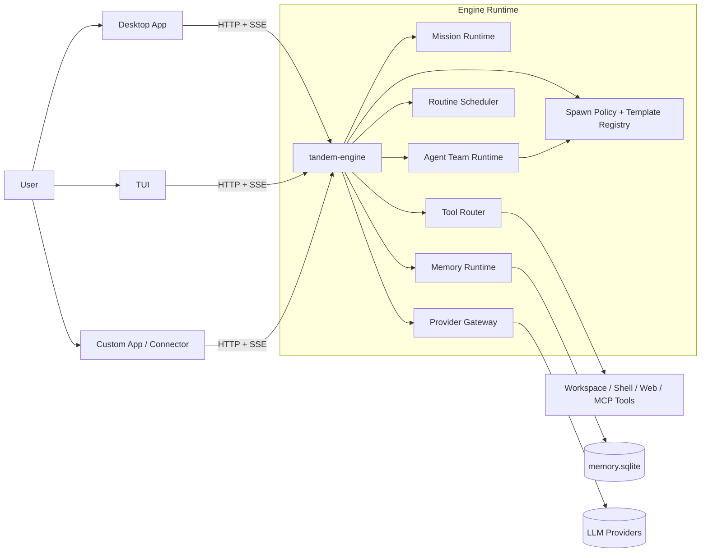
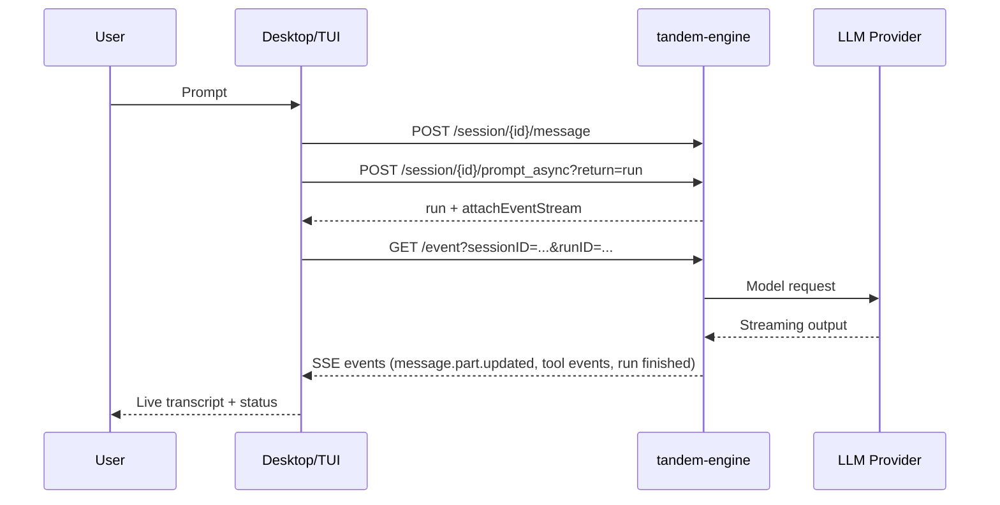
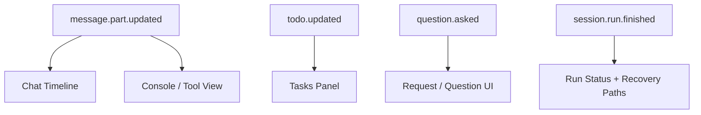

This page gives a practical mental model of how Tandem components fit together.

## System Overview

```mermaid
flowchart LR
  U[User] --> D[Desktop App]
  U --> T[TUI]
  U --> X[Custom App / Connector]
  D -->|HTTP + SSE| E[tandem-engine]
  T -->|HTTP + SSE| E
  X -->|HTTP + SSE| E

  subgraph Engine Runtime
    E --> S[Session + Run APIs]
    E --> M[Mission Runtime]
    E --> AT[Agent Team Runtime]
    E --> R[Routine Scheduler]
    E --> P[Provider Gateway]
    E --> TOOLS[Tool Router]
    E --> MEM[Memory Runtime]
  end

  TOOLS --> FS[Workspace / Shell / Web / MCP Tools]
  AT --> S[Spawn Policy + Template Registry]
  MEM --> DB[(memory.sqlite)]
  P --> LLM[(LLM Providers)]
```

## Request Lifecycle

```mermaid
sequenceDiagram
  participant User
  participant Client as Desktop/TUI
  participant Engine as tandem-engine
  participant Provider as LLM Provider

  User->>Client: Prompt
  Client->>Engine: POST /session/{id}/message
  Client->>Engine: POST /session/{id}/prompt_async?return=run
  Engine-->>Client: run + attachEventStream
  Client->>Engine: GET /event?sessionID=...&runID=...
  Engine->>Provider: Model request
  Provider-->>Engine: Streaming output
  Engine-->>Client: SSE events (message.part.updated, tool events, run finished)
  Client-->>User: Live transcript + status
```

## Event Model

```mermaid
flowchart TD
  A[message.part.updated] --> B[Chat Timeline]
  A --> C[Console / Tool View]
  D[todo.updated] --> E[Tasks Panel]
  F[question.asked] --> G[Request / Question UI]
  H[session.run.finished] --> I[Run Status + Recovery Paths]
```
