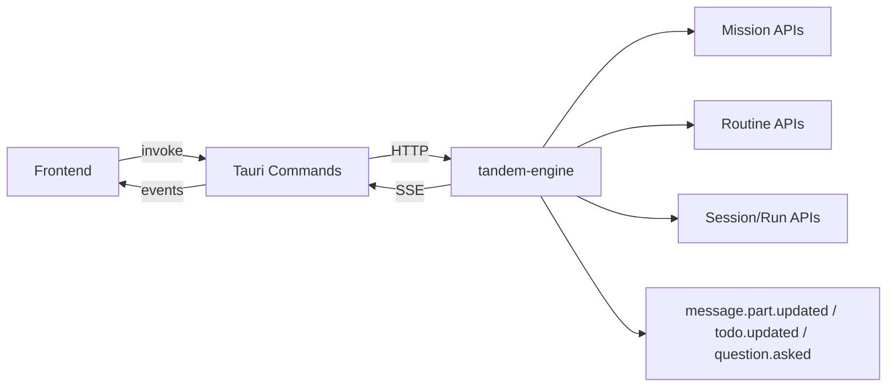

This matrix summarizes the engine-backed contracts between Desktop/TUI clients and the engine runtime.

## Frontend <-> Tauri Commands

| Command                                                  | Contract                                                                                                           |
| -------------------------------------------------------- | ------------------------------------------------------------------------------------------------------------------ |
| `get_storage_migration_status` / `run_storage_migration` | Controls startup + settings-triggered migration flow.                                                              |
| `list_plans`                                             | Reads `.tandem/plans` with legacy `.opencode/plans` fallback.                                                      |
| `read_plan_content`                                      | Reads a plan markdown file by path.                                                                                |
| `build_permission_rules`                                 | Returns rule names aligned with runtime tool names.                                                                |
| Session scope                                            | Session list is scoped to the active workspace.                                                                    |
| `agent_team_*` commands                                  | Desktop Agent Automation bridge for templates, instances, missions, approvals, spawn, and cancel/decision actions. |

## Tauri <-> Engine HTTP

| Endpoint                                                 | Contract                                                                                        |
| -------------------------------------------------------- | ----------------------------------------------------------------------------------------------- |
| `GET /session?scope=workspace&workspace=<abs>`           | Workspace-scoped session list (engine-enforced).                                                |
| `GET /session?scope=global`                              | Explicit cross-workspace list for advanced/debug flows.                                         |
| `POST /session/{id}/attach`                              | Explicit attach across workspaces with audit fields.                                            |
| `POST /session/{id}/workspace/override`                  | Temporary sandbox override with TTL.                                                            |
| `GET /provider`                                          | Provider catalog with default/connected metadata.                                               |
| `POST /mission` / `POST /automations` / `POST /routines` | Mission + automation lifecycle endpoints (`routines/*` remains compatible).                     |
| `POST /mission/{id}/event`                               | Mission reducer endpoint; `mission_started` can trigger orchestrator-runtime Agent Team spawns. |
| `GET /agent-team/templates`                              | Lists loaded Agent Team templates from workspace config.                                        |
| `GET /agent-team/instances`                              | Lists agent instances with mission/parent/status filters.                                       |
| `GET /agent-team/missions`                               | Lists mission-level Agent Team status rollups and usage totals.                                 |
| `GET /agent-team/approvals`                              | Lists pending spawn approvals + pending tool approvals for agent-team sessions.                 |
| `POST /agent-team/spawn`                                 | Server-gated spawn with policy, edge, and skill checks.                                         |
| `POST /agent-team/approvals/spawn/{id}/approve`          | Approves a queued spawn request and executes gated spawn path.                                  |
| `POST /agent-team/approvals/spawn/{id}/deny`             | Denies a queued spawn request with auditable reason.                                            |
| `POST /agent-team/instance/{id}/cancel`                  | Cancels a single agent instance and child session execution.                                    |
| `POST /agent-team/mission/{id}/cancel`                   | Cancels all tracked agent instances for a mission.                                              |

## Engine SSE -> Client Events

| Event                                 | Contract                                                                                          |
| ------------------------------------- | ------------------------------------------------------------------------------------------------- |
| `message.part.updated`                | Text and tool part streaming for chat timeline + console.                                         |
| `todo.updated`                        | Normalized todo state (`pending`, `in_progress`, `completed`, `cancelled`).                       |
| `question.asked`                      | Questions with `tool.callID` for correlation.                                                     |
| `agent_team.spawn.*`                  | Spawn requested/denied/approved lifecycle with policy reason codes.                               |
| `agent_team.instance.started`         | New instance lifecycle entry (mission/instance/session lineage).                                  |
| `agent_team.budget.usage`             | Live budget counters (`tokensUsed`, `stepsUsed`, `toolCallsUsed`, `costUsedUsd`, `elapsedMs`).    |
| `agent_team.budget.exhausted`         | Budget limit reached; runtime emits reason and usage snapshot.                                    |
| `agent_team.mission.budget.exhausted` | Mission total budget exhaustion; runtime emits mission-level usage snapshot.                      |
| `agent_team.instance.cancelled`       | Instance cancellation (manual or budget exhaustion) with reason.                                  |
| `agent_team.instance.completed`       | Instance reached completed terminal state.                                                        |
| `agent_team.instance.failed`          | Instance reached failed terminal state.                                                           |
| `agent_team.capability.denied`        | Runtime capability guard blocked a disallowed tool/capability access.                             |
| `provider.usage`                      | Provider-reported token usage (`promptTokens`, `completionTokens`, `totalTokens`) when available. |
| `storage-migration-progress`          | Migration phase/progress/counters.                                                                |
| `storage-migration-complete`          | Migration completion status and summary.                                                          |

## Canonical Event Examples

### `message.part.updated` (text)

```json
{
  "type": "message.part.updated",
  "properties": {
    "part": {
      "id": "part_123",
      "sessionID": "ses_123",
      "messageID": "msg_123",
      "type": "text",
      "text": "Hello"
    },
    "delta": "Hello"
  }
}
```

### `todo.updated`

```json
{
  "type": "todo.updated",
  "properties": {
    "sessionID": "ses_123",
    "todos": [{ "id": "t1", "content": "Audit contracts", "status": "pending" }]
  }
}
```

### `question.asked`

```json
{
  "type": "question.asked",
  "properties": {
    "id": "q_123",
    "sessionID": "ses_123",
    "messageID": "msg_123",
    "questions": [
      {
        "header": "Scope",
        "question": "Pick one",
        "options": [{ "label": "A", "description": "..." }]
      }
    ],
    "tool": { "callID": "call_2", "messageID": "msg_123" }
  }
}
```

## JSON-First Orchestrator Contract

Tandem validates planner + validator responses as strict JSON first. The strict mode can be enabled with:

```bash
TANDEM_ORCH_STRICT_CONTRACT=1
```

Strict mode emits `contract_warning` or `contract_error` events when the JSON contract is degraded.

## Protocol Flow Diagram


