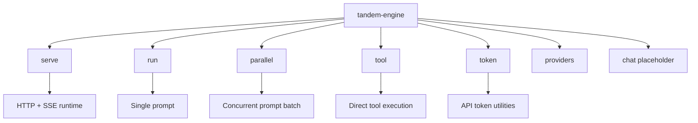

The `tandem-engine` binary supports several subcommands for running the server and executing tasks.

## Command Map



## `serve`

Starts the Tandem Engine server. This is the default mode for handling client connections.

```bash
tandem-engine serve [OPTIONS]
```

**Options:**

- `--hostname <HOSTNAME>` / `--host <HOSTNAME>`: The interface to bind to (default: `127.0.0.1`, env: `TANDEM_ENGINE_HOST`).
- `--port <PORT>`: The port to listen on (default: `39731`, env: `TANDEM_ENGINE_PORT`).
- `--state-dir <DIR>`: Custom directory for storing engine state (config, logs, storage).
- `--in-process`: Run in in-process mode (for development/debugging).
- `--provider <ID>`: Provider ID for this process (`openai`, `openrouter`, `anthropic`, `ollama`, `groq`, `mistral`, `together`, `azure`, `bedrock`, `vertex`, `copilot`, `cohere`).
- `--model <ID>`: Provider model override for this process.
- `--api-key <KEY>`: API key override for the selected provider for this process.
- `--config <PATH>`: Override config file path.
- `--api-token <TOKEN>`: Require token auth for HTTP endpoints (Authorization Bearer or `X-Tandem-Token`, env: `TANDEM_API_TOKEN`).

## `run`

Execute a single prompt and exit. Useful for quick CLI queries or scripting.

```bash
tandem-engine run "<PROMPT>"
```

**Options:**

- `--provider <ID>`: Provider for this run. Unknown IDs fail fast.
- `--model <ID>`: Provider model override for this run.
- `--api-key <KEY>`: API key override for this run's provider.
- `--config <PATH>`: Override config file path.

**Example:**

```bash
tandem-engine run "What is the capital of France?"
```

**Provider precedence:**

- `run --provider` uses that provider explicitly.
- If no explicit provider is passed, `default_provider` from config is used.
- If `default_provider` is missing or unavailable, Tandem falls back to the first configured provider.

**API key behavior:**

- `--api-key` applies only to the selected provider for that command invocation.
- Without `--api-key`, Tandem uses provider-specific config/env vars (for example `OPENROUTER_API_KEY`, `OPENAI_API_KEY`, `ANTHROPIC_API_KEY`).

## `tool`

Execute a specific tool directly by passing a JSON payload.

```bash
tandem-engine tool --json '<JSON_PAYLOAD>'
```

**Options:**

- `--json <JSON>`: The JSON payload defining the tool and arguments. Can be a raw string, a file path (`@path/to/file.json`), or `-` for stdin.
- `--state-dir <DIR>`: Custom state directory.

**Example Payload:**

```json
{
  "tool": "read",
  "args": {
    "path": "README.md"
  }
}
```

## `chat`

Planned interactive REPL mode. This command is currently a placeholder.

## `parallel`

Run multiple prompts concurrently and return a JSON summary.

```bash
tandem-engine parallel --json '<JSON_PAYLOAD>' --concurrency 4
```

**Options:**

- `--json <JSON>`: Array of prompts, array of objects, or `{ "tasks": [...] }` wrapper. Accepts raw JSON, `@file`, or `-` for stdin.
- `--concurrency <N>`: Max concurrent tasks (default: `4`).
- `--provider <ID>`: Default provider for tasks without explicit provider.
- `--model <ID>`: Default model override for the provider.
- `--api-key <KEY>`: API key override for this batch.
- `--config <PATH>`: Override config file path.

## `providers`

List supported provider IDs for `--provider`.

```bash
tandem-engine providers
```

## `token`

API token utilities (used with `--api-token`).

```bash
tandem-engine token generate
```

## Agent Team HTTP Examples

These are HTTP endpoints exposed by the running engine (not CLI subcommands).

```bash
curl -s http://127.0.0.1:39731/agent-team/templates | jq .
curl -s http://127.0.0.1:39731/agent-team/instances | jq .
curl -s -X POST http://127.0.0.1:39731/agent-team/spawn \
  -H "content-type: application/json" \
  -d '{"missionID":"m1","role":"worker","templateID":"worker-default","source":"ui_action","justification":"parallelize implementation"}' | jq .
```

## Practical Examples

### Run Engine with API Token

```bash
TANDEM_API_TOKEN="tk_your_token_here" tandem-engine serve --hostname 127.0.0.1 --port 39731
```

### Run One Prompt with Explicit Provider and Model

```bash
tandem-engine run "Write a concise release summary." --provider openrouter --model openai/gpt-4o-mini
```

### Run a Concurrent Batch

```bash
cat > tasks.json << 'JSON'
{
  "tasks": [
    { "id": "plan", "prompt": "Create a 3-step rollout plan." },
    { "id": "risks", "prompt": "List top 5 rollout risks." },
    { "id": "comms", "prompt": "Draft a short launch update." }
  ]
}
JSON

tandem-engine parallel --json @tasks.json --concurrency 3
```

### Execute Tools Directly

```bash
tandem-engine tool --json '{"tool":"workspace_list_files","args":{"path":"."}}'
tandem-engine tool --json '{"tool":"websearch","args":{"query":"tandem engine protocol matrix","limit":5}}'
tandem-engine tool --json '{"tool":"memory_search","args":{"query":"mission runtime","project_id":"tandem","tier":"project","limit":5}}'
```

`spawn_agent` is runtime-gated and should be called from a session prompt (not `tandem-engine tool` direct mode):

```bash
curl -s -X POST http://127.0.0.1:39731/session/<session_id>/prompt_async \
  -H "content-type: application/json" \
  -d '{"parts":[{"type":"text","text":"/tool spawn_agent {\"missionID\":\"m1\",\"role\":\"worker\",\"templateID\":\"worker-default\",\"source\":\"tool_call\",\"justification\":\"parallelize implementation\"}"}]}'
```

### Browser Playground (Interactive)

Use the included browser playground in `docs/example.html` to test:

- session creation
- async runs + SSE streaming
- token-auth requests
- mission/routine API interactions

```bash
python -m http.server 8080 --directory docs
```

Then open `http://127.0.0.1:8080/example.html`.
